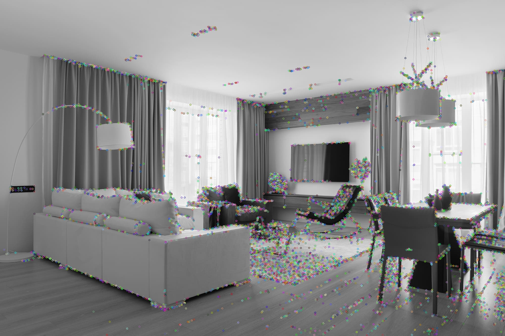
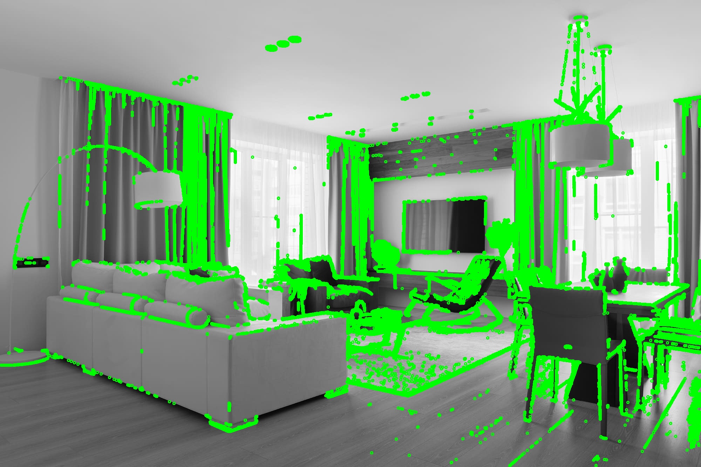
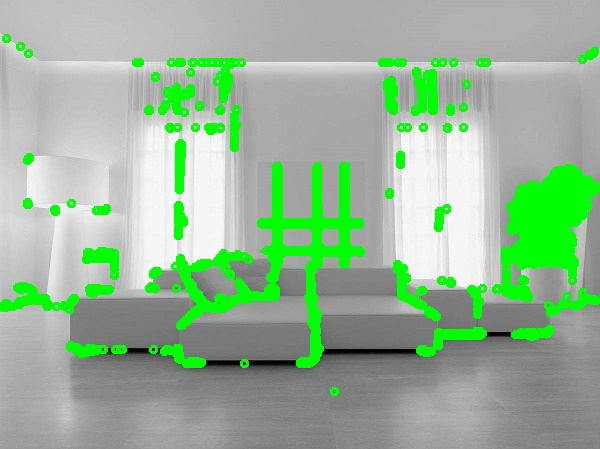

# CornerDetection_Test
This program uses a library like OpenCV, please ensure that it is installed on your system.
I'm unsure about file opening functionality because my profile name is in Cyrillic. I needed to access files directly on the C drive. Please verify file operations before getting started.

## OpenCV FAST method

## My FAST method

## KLT

## My pyramid KLT

